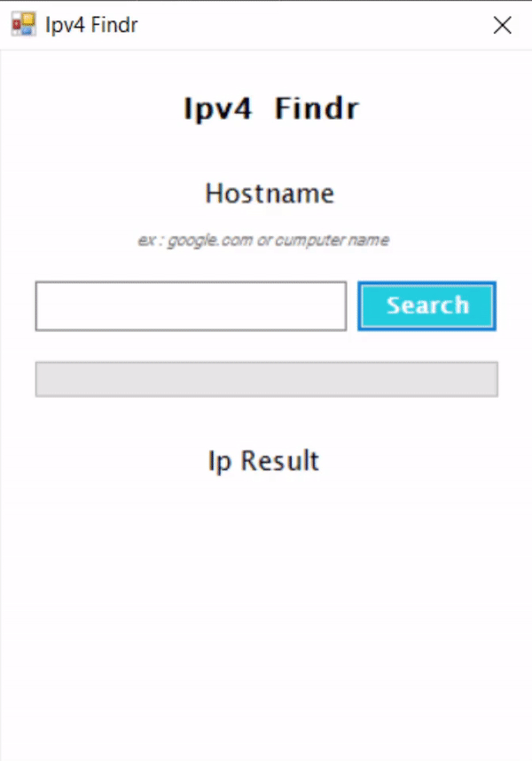

# IPv4 Findr
A simple program that finds the ip address of a computer on a domain.
By using `Resolve-DnsName` its also able to find the ip address of any website.

## Easy to use
1. Execute
2. Write
3. Search
4. Find

 

And there you have it. an easy ip finder written in powershell.
Big shout out to [POSHGUI](https://poshgui.com/), a website where you can create your script GUI without the hustle and bustle of typing it yourself.
